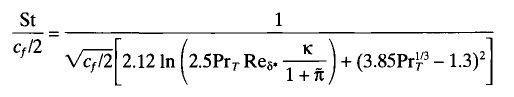

# GA3 Heat Exchanger Design

## Constraints
### Direct
- Total pipe length `Nt*lt < 3.5m`
- Total length `lt+2*l_plenum<0.35m`
- Total mass `m<1.10kg`
### Indirect
- plenum length must fit nozzles
  - 1-pass design has both plenum lengths `lp>=0.04` -> `lt<=0.27` so `Nt>=13`
  - 2-pass design has plenum lengths `lp1>=0.04`, `lp2` unconstrained -> `lt<=0.34` so `Nt>=11`
- tube pitch must be greater than tube diameter `Y>=DO`, restricts number of tubes `Nt` to 47

